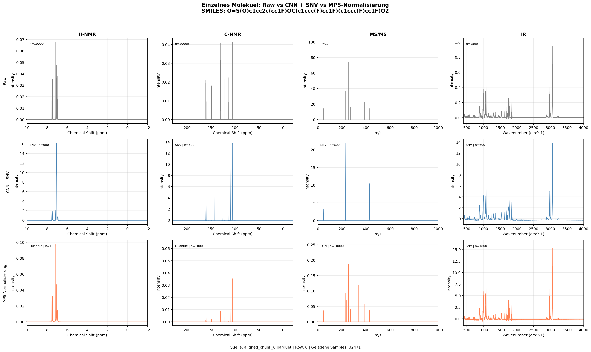

# Einzelnes Sample: Raw vs CNN + SNV vs MPS

**SMILES**

`O=S(O)c1cc2c(cc1F)OC(c1ccc(F)cc1F)(c1ccc(F)cc1F)O2`

**Quelle**

- Chunk: `aligned_chunk_0.parquet`
- Row im Chunk: `0`
- Geladene Samples: `32471` aus den ersten `10` Chunks

**Plot**

**Hinweis**

- Die Zeilen zeigen `Raw`, `CNN + SNV` und `MPS-Normalisierung`.
- Die vier Spalten zeigen `H-NMR`, `C-NMR`, `MS/MS` und `IR`.
- Die Achsenskalierung fuer H-NMR, C-NMR und IR folgt direkt den in `data/meta_data/meta_data_dict.json` definierten `dimensions`.
- Fuer MS/MS gibt es dort keine festen `dimensions`; die dichte Darstellung folgt deshalb dem verwendeten Binning mit `10000` Bins bei `0.1 m/z` pro Bin.
